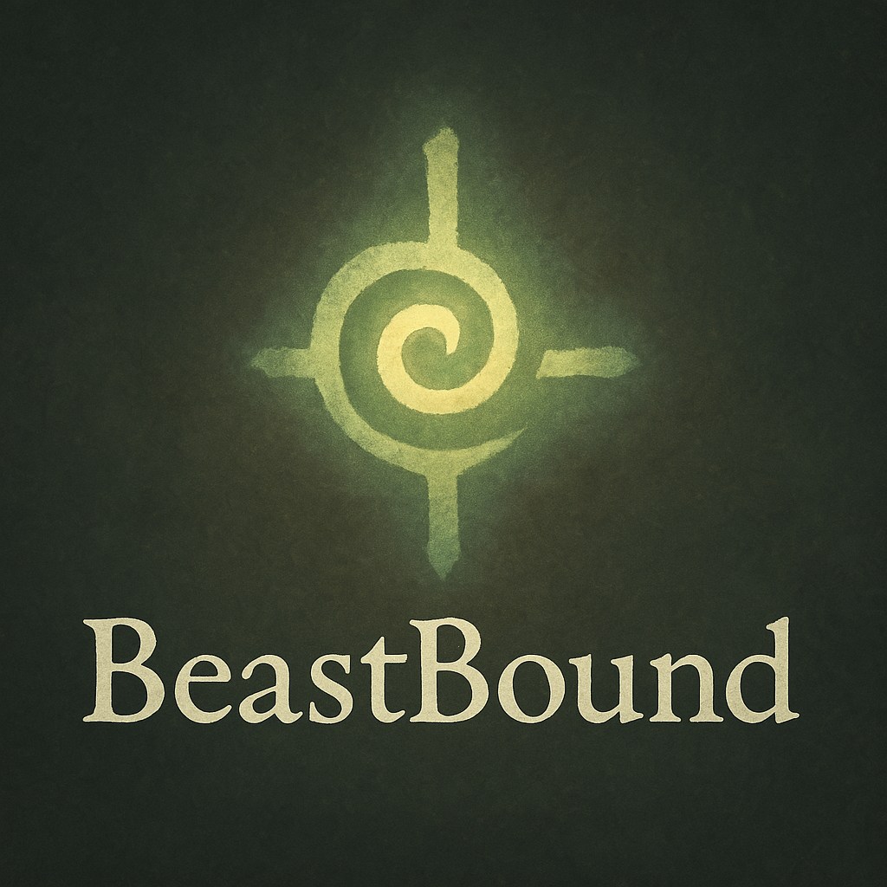

# BeastBound

**BeastBound** is a contemplative, text-based role-playing game where players journey through sacred landscapes, bond with Beasts, and uncover forgotten names. The game subtly weaves Christian themes with a focus on stillness, spiritual discovery, and narrative exploration.

---

## 🧭 How to Play

BeastBound is played entirely within **ChatGPT**. To begin your adventure, visit the link below to start your journey:

👉 [**Play BeastBound here!**](https://chatgpt.com/g/g-67f3679c9db48191848b8df330156956-beastbound)

For more details on gameplay, see:

👉 [`player-guides/how_to_play.md`](./player-guides/how_to_play.md)

---

## 🌀 How to Submit a New Beast Discovery

If you encounter a **new Beast** that isn’t canon yet (i.e., it has an ID number like `???` and a missing name), follow the detailed instructions for submitting your discovery here:

👉 [`player-guides/submit_beast.md`](./player-guides/submit_beast.md)

---

## 🔮 Features

- 🌀 **Echo Mark-based bonding system** – Your silence, choices, and Scripture shape how Beasts respond.
- 📖 **Journaling mechanic** – Record not just events, but spiritual insights and moments of peace.
- 🔄 **Beast Trading and Syncing** – Share your discovered Beasts across adventures. Future support for syncing creature libraries.
- 🌿 **Lore-rich world** – Locations like Rootvale, Blazegut Caverns, Wyrmwood Depths, and Azure Lake.
- 🧭 **Non-linear progression** – Your journey is shaped by stillness, memory, and witness — not conquest.

---

## 🧬 Design Philosophy

BeastBound emphasizes:

- **Christian contemplation** – Scripture, silence, and memory as spiritual tools.
- **Calm gameplay** – No rushing, no grinding. Presence is power.
- **Sacred encounters** – Some Beasts join through reverence, not battle.

---

## 📁 Repo Contents

- `lore/` – Worldbuilding, Beasts, and Echo Mark documentation
- `engine/` – Game logic, save formats, and trading schemas
- `player-guides/` – How to begin, bond, and journal
- `assets/` – Logos, illustrations, and media
- `design_manifesto.md` – A guiding document for contributors

---

## 🛠️ Contributing

See `CONTRIBUTING.md` for how to help grow the BeastBound world. Writers, artists, and spiritually-minded designers welcome.

---

> *“You do not catch a sacred thing. You listen to it. And if you are quiet enough... it may listen back.”*